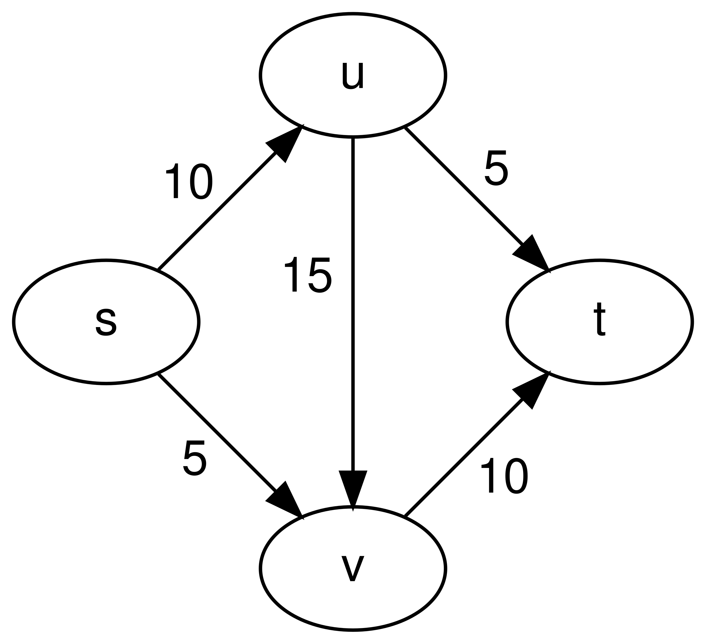

# Maximum Flow

Efficient computation of [maximum flow](https://en.wikipedia.org/wiki/Maximum_flow_problem) on a [flow network](https://en.wikipedia.org/wiki/Flow_network). The program implements the [Edmonds-Karp algorithm](https://en.wikipedia.org/wiki/Edmonds%E2%80%93Karp_algorithm), which is based on the [Ford-Fulkerson method](https://en.wikipedia.org/wiki/Ford%E2%80%93Fulkerson_algorithm) and runs in $O(VE^2)$ time. The network capacity and resultant maximum flow for a graph *G* = (*V*, *E*) are represented as numpy matrices of shape (|*V*|, |*V*|).

```text
Usage: main.py [OPTIONS]

  Compute maximum flow on flow network.

Options:
  -f, --filename FILE  Path to flow network specification.  [required]
  -v, --verbose        Set verbosity of solving process.
  --help               Show this message and exit.
```

## File Format

Graph file should be in [DIMACS format](http://lpsolve.sourceforge.net/5.5/DIMACS_maxf.htm) for networks. A tutorial on the expected input format is shown below.

```text
c Lines beginning with a "c" are for comments.
c They are ignored by the parser.
c We do not consider them statements.

p max 4 5

c This is the problem statement. It must appear first.
c Problem statements start with "p max".
c This signifies that we are defining a max flow problem.
c "p max" is followed by the number of node / vertices (4).
c After nodes, we specify the number of arcs / edges (5).
c By convention, n nodes are referenced with numbers 0, ..., n - 1.

n 0 s
n 3 t

c The next 2 statements must specify the source (s) and sink (t).
c They start with "n" and must appear in order -- source then sink.
c Here, we mark node 0 as the source and node 2 as the sink.

a 0 1 10
a 1 3 5
a 0 2 5
a 2 3 10
a 1 2 15

c The remaining statements are used to list the arcs and capacities.
c All arc statements must begin with "a" followed by 3 numbers.
c The first 2 numbers are the start and end node of this arc.
c The 3rd number is the flow capacity of this arc.
```

See the `tst` directory for more examples.

## Output

Running the example input above, we get:

```text
$ python3 main.py -f sample.txt -v
INFO:flow_network:Initialized network with 4 nodes flowing from 0 to 3
INFO:flow_network:Adding arc 0 -> 1 with capacity 10
INFO:flow_network:Adding arc 1 -> 3 with capacity 5
INFO:flow_network:Adding arc 0 -> 2 with capacity 5
INFO:flow_network:Adding arc 2 -> 3 with capacity 10
INFO:flow_network:Adding arc 1 -> 2 with capacity 15
INFO:flow_network:Found path [0, 1, 3] that augments flow by 5
INFO:flow_network:Found path [0, 2, 3] that augments flow by 5
INFO:flow_network:Found path [0, 1, 2, 3] that augments flow by 5
Maximum flow = 15
0 -> 1 : 10 / 10
0 -> 2 : 5 / 5
1 -> 2 : 5 / 15
1 -> 3 : 5 / 5
2 -> 3 : 10 / 10
```

The output line `u -> v : f / c` should be interpreted as saying that the arc from node *u* to node *v* gets flow *f* of its capacity *c*. We solved the max flow for the network below, where *s* is source node 0, *u* is node 1, *v* is node 2, and *t* is sink node 3.



## Testing

Run `pytest` to test the program on all `tst/network_*.txt` inputs. All properties of a valid flow are verified and the maximum flow rate is checked against the known solution.
